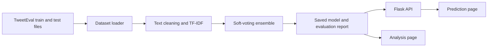

# TweetSense project guide

This guide describes the TweetSense sentiment demo from data download to browser output. The repository also retains benchmark modules for other datasets and models; the TweetSense path uses only the components described here.

## Contents

1. [System overview](#system-overview)
2. [Requirements and installation](#requirements-and-installation)
3. [Dataset](#dataset)
4. [Training and evaluation](#training-and-evaluation)
5. [Web pages and API](#web-pages-and-api)
6. [Files produced at runtime](#files-produced-at-runtime)
7. [Testing](#testing)
8. [Troubleshooting](#troubleshooting)

## System overview



The training program reads the official TweetEval train and test splits. It fits the text cleaner, TF-IDF vectorizer, and classifiers on training data. Cross-validation on that training split measures model stability. The untouched test split supplies the final metrics. The exported pipeline contains the cleaner, vectorizer, and ensemble so browser predictions follow the same preprocessing path as training.

The ensemble uses a **soft vote**: logistic regression, calibrated linear SVM, and Multinomial Naive Bayes each return a probability for negative, neutral, and positive. The voting classifier averages those probabilities and selects the highest. Its definition is in `configs/tweet_sentiment.yaml` and its implementation is in `src/sentiment_benchmark/models/classical.py`.

## Requirements and installation

- Python 3.11 or 3.12
- Internet access once to install packages and download TweetEval
- Enough free disk space for the Python environment, model, and charts

On Windows PowerShell, run these commands from the repository root:

```powershell
py -3.12 -m venv .venv
.venv\Scripts\python.exe -m pip install -e .
.venv\Scripts\python.exe scripts\download_tweeteval.py
.venv\Scripts\sentiment-benchmark.exe benchmark --config configs\tweet_sentiment.yaml --no-tracking
.venv\Scripts\python.exe app\app.py
```

On macOS or Linux, create the environment with `python3.12 -m venv .venv`, then use `.venv/bin/python` and `.venv/bin/sentiment-benchmark` in place of the Windows executable paths.

Open `http://127.0.0.1:8765/` after Flask reports that it is listening. Keep the terminal running while using the site. Stop it with Ctrl+C.

## Dataset

[TweetEval sentiment](https://github.com/cardiffnlp/tweeteval/tree/main/datasets/sentiment) contains labeled Twitter posts. The demo uses these files:

```text
data/raw/tweet_sentiment/
  train_text.txt
  train_labels.txt
  test_text.txt
  test_labels.txt
```

The download script obtains them from the official TweetEval repository. Label `0` means negative, `1` neutral, and `2` positive. The loader checks that each text file has the same number of rows as its label file and that labels are valid. The local run loaded 45,615 training tweets and 12,284 test tweets. The raw files are ignored by Git; download them after cloning.

The project does not call the live X/Twitter API. It predicts sentiment for text entered by the user, using a previously published tweet dataset for training.

## Training and evaluation

`configs/tweet_sentiment.yaml` defines the dataset, official test split, text cleaning, TF-IDF feature settings, two-fold cross-validation, and the three classifier ensemble. Run:

```powershell
.venv\Scripts\sentiment-benchmark.exe benchmark --config configs\tweet_sentiment.yaml --no-tracking
```

The command exports `models/tweet_sentiment/best.joblib` for prediction and writes `models/tweet_sentiment/model_card.json` with the dataset fingerprint, configuration, class metrics, and overall scores. It also writes `reports/results.csv`, `reports/results.md`, and charts under `reports/figures/`.

The checked-in model card records **58.7% test accuracy** and **55.2% test macro F1**. Macro F1 gives each sentiment class equal weight. The test split was held out from fitting and model selection. Real-world performance may differ, particularly for new slang, irony, and topic shifts.

The repository also contains the original benchmark's Naive Bayes, forest, XGBoost, CNN, BiLSTM, IMDB, vaccine-tweet, and hate-speech experiments. They are separate from the TweetSense training configuration.

## Web pages and API

Run `.venv\Scripts\python.exe app\app.py` and open:

- `/` — enter a tweet, select a model, and view its predicted label, confidence, and three probability bars.
- `/analysis` — read the held-out metrics, per-class scores, and generated charts.
- `/health` — check whether the API is running and which models are available.
- `/api/models` — inspect available model cards.
- `/api/predict` — submit one text or a list of texts for prediction.

The frontend is in `app/templates/index.html`, `app/templates/analysis.html`, `app/static/style.css`, and `app/static/app.js`. JavaScript sends the input to the Flask API, then displays the returned class probabilities in the result panel. The analysis page reads the saved model card and report files.

Example API request:

```powershell
$body = @{ dataset = 'tweet_sentiment'; text = 'I love this app!' } | ConvertTo-Json
Invoke-RestMethod -Uri 'http://127.0.0.1:8765/api/predict' -Method Post -ContentType 'application/json' -Body $body
```

The response contains `dataset`, `model`, `features`, `latency_ms`, and a `results` list. Each result contains the predicted `label_name`, `confidence`, probabilities for all three classes, and the submitted text. The API also accepts `texts` as a list of up to 200 strings; each string is limited to 5,000 characters.

The Flask app records predictions in a local SQLite database at `reports/predictions.db` by default. PostgreSQL is an optional deployment backend selected with `DATABASE_URL`; it is not required for the demo.

## Files produced at runtime

| Path | Purpose | In Git? |
| --- | --- | --- |
| `data/raw/tweet_sentiment/` | Downloaded tweets and labels | No |
| `models/tweet_sentiment/best.joblib` | Trained prediction pipeline | No |
| `models/tweet_sentiment/model_card.json` | Evaluation and model metadata | Yes |
| `reports/results.csv` and `reports/results.md` | Benchmark table | Yes |
| `reports/figures/*tweet_sentiment*.png` | Evaluation charts | Yes |
| `reports/predictions.db` | Local prediction log | No |

Because the trained weights are not committed, a fresh clone needs the download and training steps before the prediction page can use the model.

## Testing

Install the development extras, then run the project checks:

```powershell
.venv\Scripts\python.exe -m pip install -e '.[dev]'
.venv\Scripts\ruff.exe check src app tests
.venv\Scripts\ruff.exe format --check src app tests
.venv\Scripts\python.exe -m pytest -q
```

The synthetic-data smoke benchmark can exercise the full pipeline without downloading tweets:

```powershell
.venv\Scripts\sentiment-benchmark.exe benchmark --smoke --no-tracking
```

GitHub Actions runs linting, tests, and a smoke benchmark on pushes to `main`. Its PostgreSQL service is for optional storage integration tests; the browser demo uses SQLite unless configured otherwise.

## Troubleshooting

- **No model appears on the page:** run the TweetEval download and benchmark commands, then restart Flask. Check for `models/tweet_sentiment/best.joblib`.
- **The page cannot be reached:** verify that the terminal says `Running on http://127.0.0.1:8765` and open port 8765 rather than port 5000.
- **Download fails:** check internet access and retry `scripts/download_tweeteval.py`. It skips files already present.
- **Package installation fails:** use Python 3.11 or 3.12. Python 3.14 is outside the package's supported range.
- **Metrics differ after retraining:** check the dataset fingerprint and dependency versions in `model_card.json`.

## Source attribution

TweetSense adapts code from [sentiment-ml-benchmark](https://github.com/rhs2/sentiment-ml-benchmark) under the MIT license. The original copyright notice remains in `LICENSE`. TweetEval has separate dataset terms; consult its repository before redistributing its data.
