# Benchmark results: tweet-sentiment-ensemble

Generated 2026-10-07 13:12 UTC, 2-fold CV, seed 42.

## tweet_sentiment (multiclass, classes: negative, neutral, positive)

Best by cross-validated F1: **ensemble + tfidf** (test F1 0.552).

| model | features | cv F1 (std) | accuracy | precision | recall | f1 | f1_weighted | fit s |
|---|---|---|---|---|---|---|---|---|
| ensemble | tfidf | 0.547 (0.002) | 0.587 | 0.602 | 0.561 | 0.552 | 0.569 | 2 |

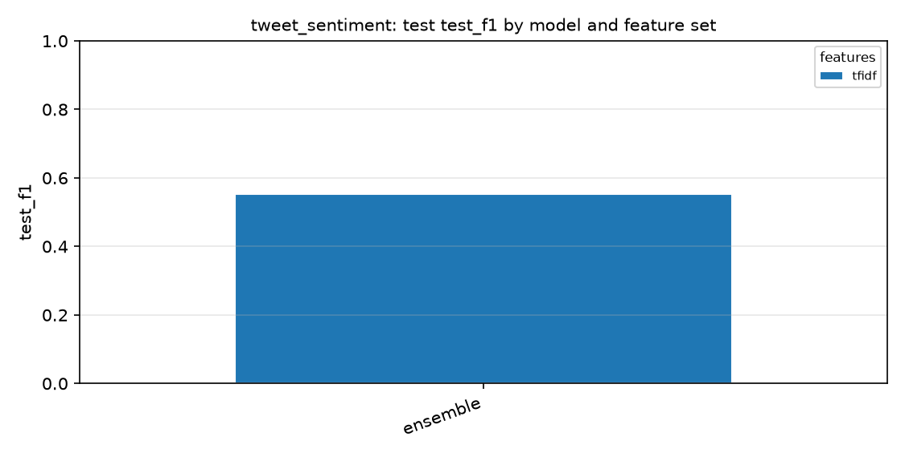
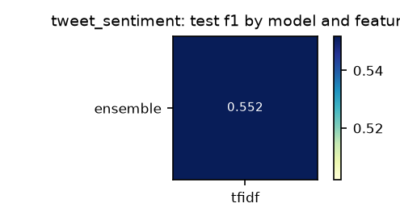
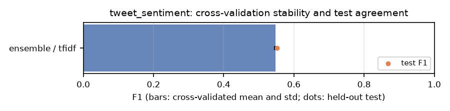
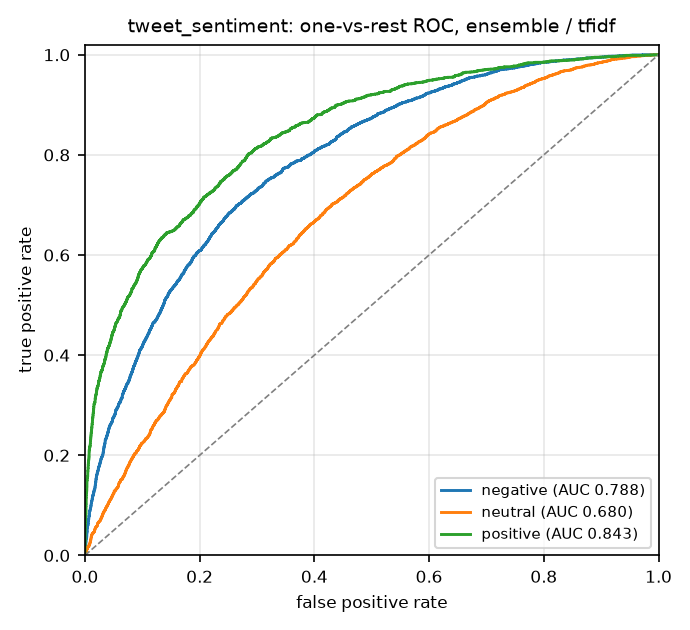
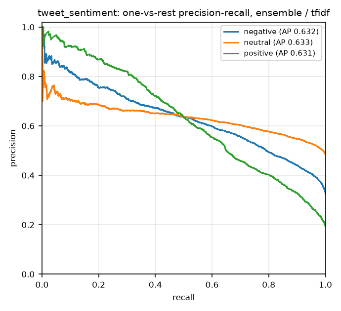
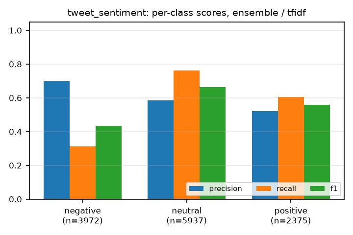
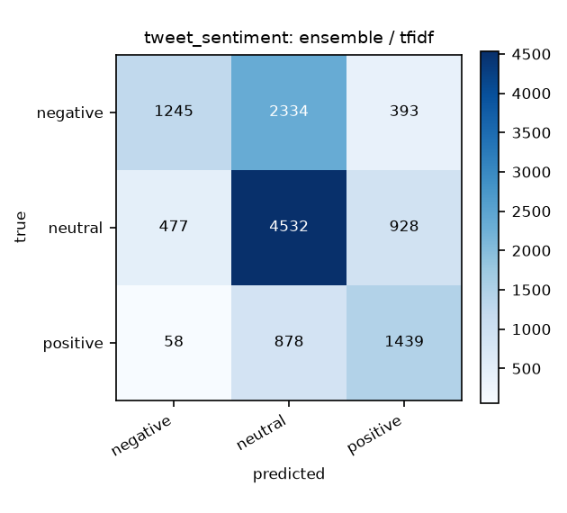
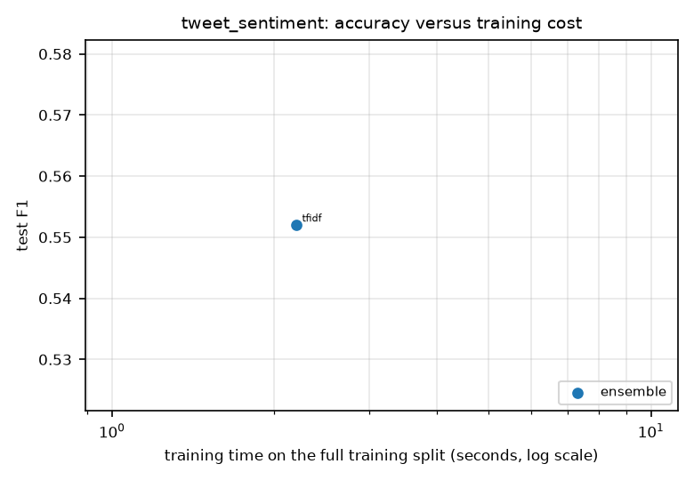

## twitter_hate (binary, classes: not_hate, hate)

Best by cross-validated F1: **cnn + sequence** (test F1 0.608).

| model | features | cv F1 (std) | accuracy | precision | recall | f1 | roc_auc | pr_auc | fit s |
|---|---|---|---|---|---|---|---|---|---|
| cnn | sequence | 0.672 (0.022) | 0.955 | 0.782 | 0.498 | 0.608 | 0.948 | 0.695 | 23 |
| lstm | sequence | 0.670 (0.018) | 0.955 | 0.712 | 0.612 | 0.658 | 0.947 | 0.698 | 29 |
| random_forest | tfidf | 0.669 (0.021) | 0.957 | 0.708 | 0.654 | 0.680 | 0.940 | 0.749 | 5 |
| xgboost | word2vec | 0.664 (0.020) | 0.958 | 0.716 | 0.654 | 0.684 | 0.952 | 0.762 | 9 |
| ensemble | tfidf | 0.659 (0.013) | 0.952 | 0.654 | 0.670 | 0.662 | 0.946 | 0.717 | 3 |
| linear_svm | tfidf | 0.654 (0.012) | 0.953 | 0.679 | 0.632 | 0.654 | 0.939 | 0.704 | 0 |
| logistic_regression | tfidf | 0.652 (0.009) | 0.952 | 0.654 | 0.654 | 0.654 | 0.945 | 0.703 | 0 |
| naive_bayes | tfidf | 0.650 (0.017) | 0.954 | 0.692 | 0.627 | 0.658 | 0.946 | 0.720 | 0 |
| naive_bayes | bow | 0.645 (0.020) | 0.949 | 0.630 | 0.643 | 0.636 | 0.947 | 0.701 | 0 |
| logistic_regression | bow | 0.643 (0.007) | 0.954 | 0.684 | 0.634 | 0.658 | 0.936 | 0.706 | 0 |
| linear_svm | bow | 0.629 (0.016) | 0.952 | 0.674 | 0.623 | 0.647 | 0.926 | 0.689 | 1 |
| random_forest | bow | 0.622 (0.014) | 0.955 | 0.696 | 0.629 | 0.661 | 0.935 | 0.723 | 5 |
| ensemble | word2vec | 0.621 (0.018) | 0.952 | 0.674 | 0.605 | 0.638 | 0.943 | 0.699 | 9 |
| random_forest | word2vec | 0.596 (0.014) | 0.939 | 0.556 | 0.643 | 0.596 | 0.947 | 0.696 | 16 |
| xgboost | bow | 0.581 (0.022) | 0.952 | 0.707 | 0.545 | 0.615 | 0.910 | 0.635 | 1 |
| xgboost | tfidf | 0.574 (0.022) | 0.948 | 0.642 | 0.569 | 0.604 | 0.909 | 0.642 | 3 |
| linear_svm | word2vec | 0.557 (0.020) | 0.936 | 0.541 | 0.574 | 0.557 | 0.930 | 0.596 | 3 |
| logistic_regression | word2vec | 0.553 (0.026) | 0.939 | 0.567 | 0.551 | 0.559 | 0.931 | 0.600 | 0 |
| xgboost | doc2vec | 0.546 (0.014) | 0.940 | 0.575 | 0.540 | 0.557 | 0.904 | 0.613 | 6 |
| random_forest | doc2vec | 0.506 (0.009) | 0.924 | 0.469 | 0.596 | 0.525 | 0.905 | 0.553 | 19 |
| linear_svm | doc2vec | 0.431 (0.008) | 0.903 | 0.365 | 0.525 | 0.430 | 0.868 | 0.377 | 2 |
| logistic_regression | doc2vec | 0.413 (0.009) | 0.898 | 0.349 | 0.536 | 0.423 | 0.859 | 0.362 | 0 |

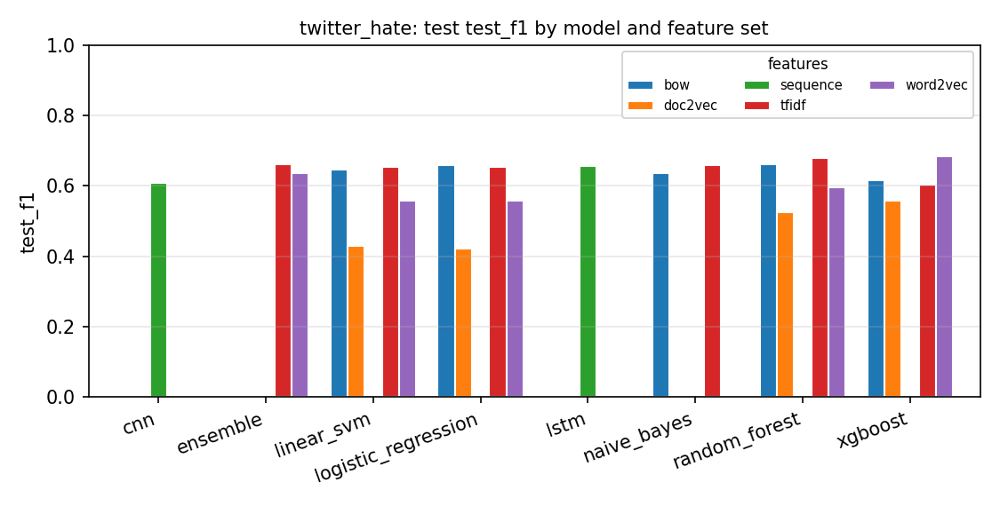
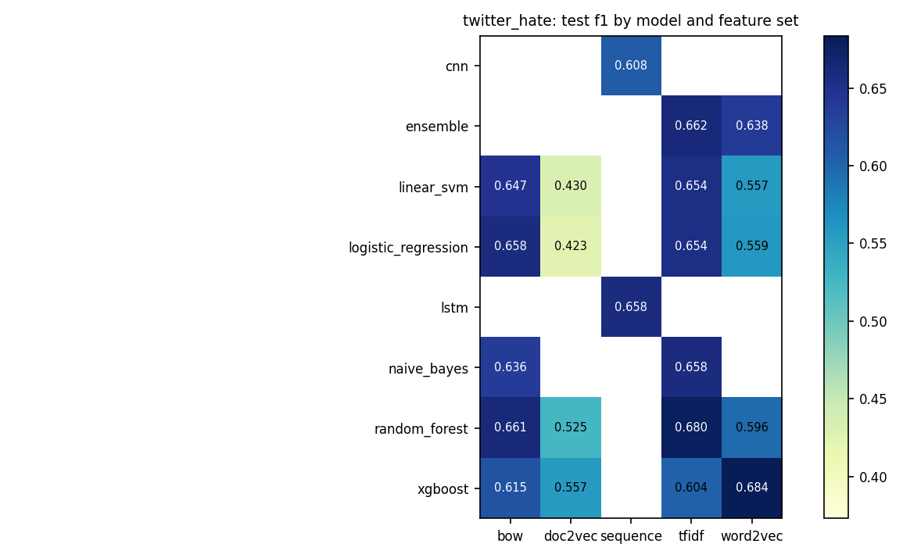
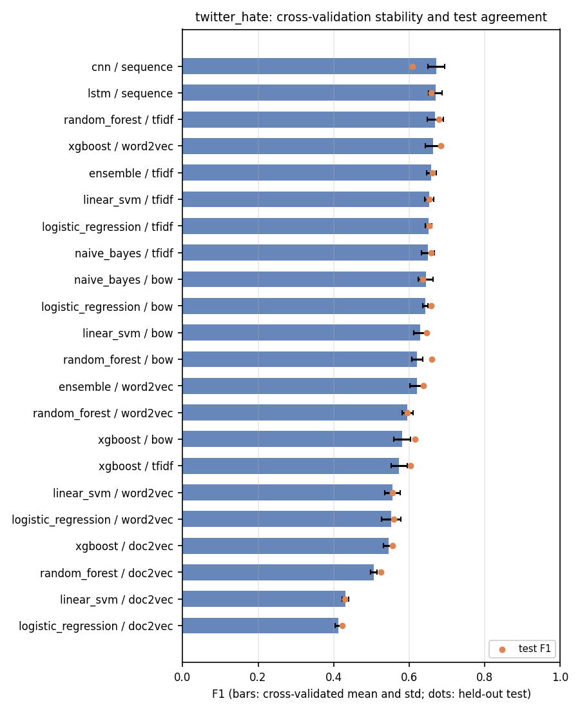
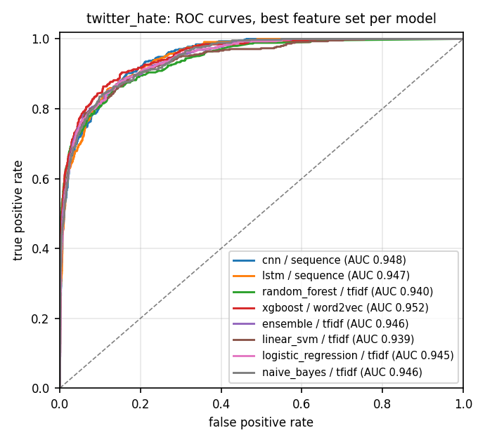
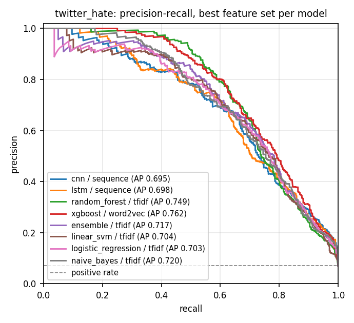
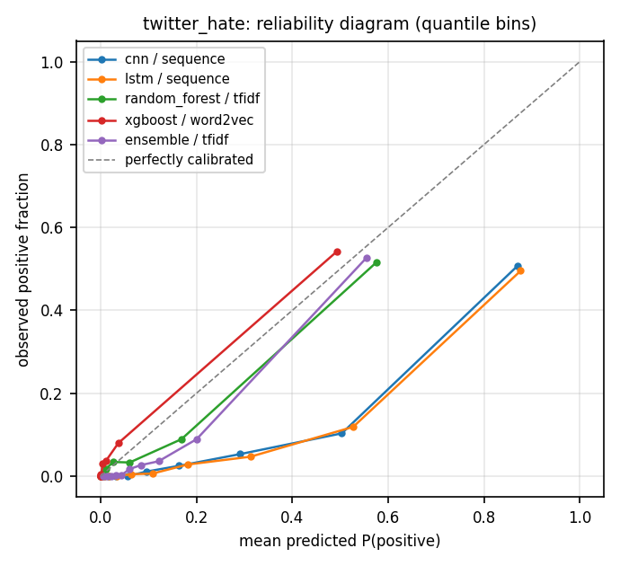
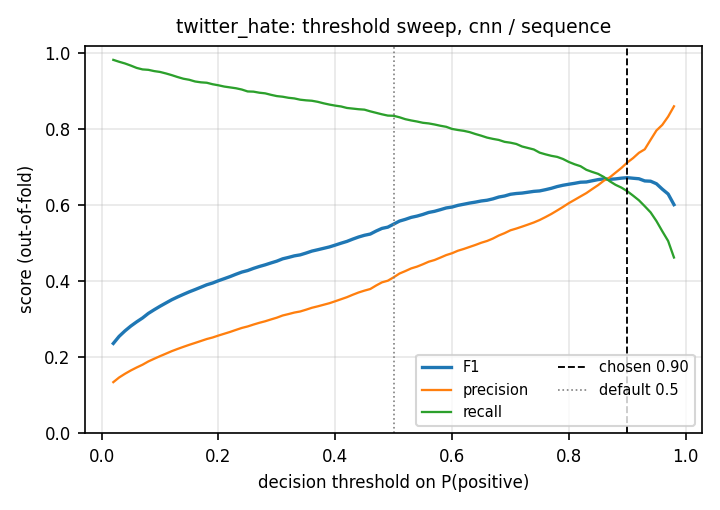
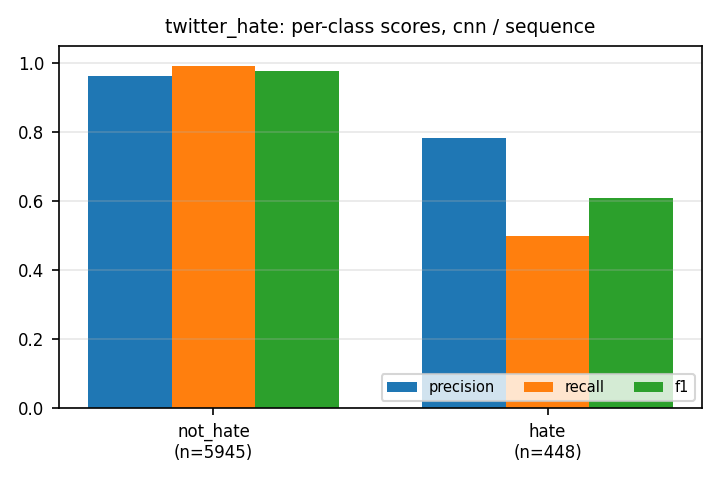
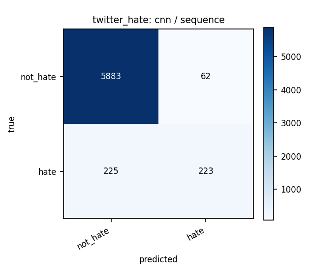
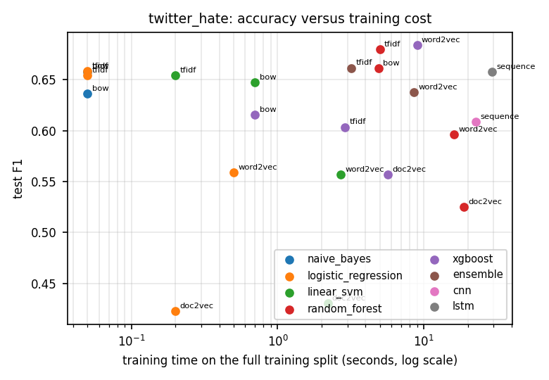

## vaccination (multiclass, classes: negative, neutral, positive)

Best by cross-validated F1: **cnn + sequence** (test F1 0.812).

| model | features | cv F1 (std) | accuracy | precision | recall | f1 | f1_weighted | fit s |
|---|---|---|---|---|---|---|---|---|
| cnn | sequence | 0.799 (0.012) | 0.859 | 0.798 | 0.830 | 0.812 | 0.861 | 11 |
| logistic_regression | bow | 0.769 (0.014) | 0.846 | 0.800 | 0.757 | 0.775 | 0.842 | 0 |
| ensemble | tfidf | 0.754 (0.014) | 0.844 | 0.842 | 0.719 | 0.757 | 0.835 | 7 |
| xgboost | bow | 0.745 (0.023) | 0.843 | 0.863 | 0.712 | 0.757 | 0.833 | 2 |
| linear_svm | bow | 0.739 (0.013) | 0.846 | 0.855 | 0.707 | 0.744 | 0.834 | 0 |
| linear_svm | tfidf | 0.735 (0.015) | 0.839 | 0.832 | 0.707 | 0.742 | 0.828 | 0 |
| logistic_regression | tfidf | 0.734 (0.010) | 0.819 | 0.752 | 0.750 | 0.750 | 0.819 | 0 |
| lstm | sequence | 0.731 (0.029) | 0.832 | 0.765 | 0.796 | 0.779 | 0.835 | 17 |
| xgboost | tfidf | 0.725 (0.027) | 0.832 | 0.859 | 0.690 | 0.733 | 0.820 | 7 |
| random_forest | bow | 0.717 (0.013) | 0.817 | 0.834 | 0.669 | 0.709 | 0.803 | 2 |
| naive_bayes | bow | 0.681 (0.011) | 0.792 | 0.713 | 0.689 | 0.698 | 0.789 | 0 |
| random_forest | tfidf | 0.670 (0.021) | 0.790 | 0.818 | 0.637 | 0.678 | 0.773 | 2 |
| naive_bayes | tfidf | 0.580 (0.017) | 0.773 | 0.752 | 0.575 | 0.578 | 0.741 | 0 |
| logistic_regression | word2vec | 0.538 (0.009) | 0.628 | 0.556 | 0.584 | 0.552 | 0.649 | 0 |
| ensemble | word2vec | 0.523 (0.003) | 0.705 | 0.589 | 0.530 | 0.538 | 0.682 | 11 |
| xgboost | word2vec | 0.499 (0.011) | 0.701 | 0.614 | 0.508 | 0.508 | 0.667 | 13 |
| logistic_regression | doc2vec | 0.478 (0.012) | 0.544 | 0.485 | 0.504 | 0.475 | 0.570 | 0 |
| random_forest | word2vec | 0.475 (0.009) | 0.675 | 0.599 | 0.468 | 0.464 | 0.627 | 6 |
| linear_svm | word2vec | 0.473 (0.004) | 0.688 | 0.537 | 0.482 | 0.467 | 0.646 | 3 |
| xgboost | doc2vec | 0.445 (0.009) | 0.659 | 0.575 | 0.465 | 0.462 | 0.620 | 12 |
| random_forest | doc2vec | 0.421 (0.006) | 0.649 | 0.551 | 0.447 | 0.439 | 0.602 | 6 |
| linear_svm | doc2vec | 0.412 (0.005) | 0.642 | 0.464 | 0.437 | 0.420 | 0.594 | 1 |

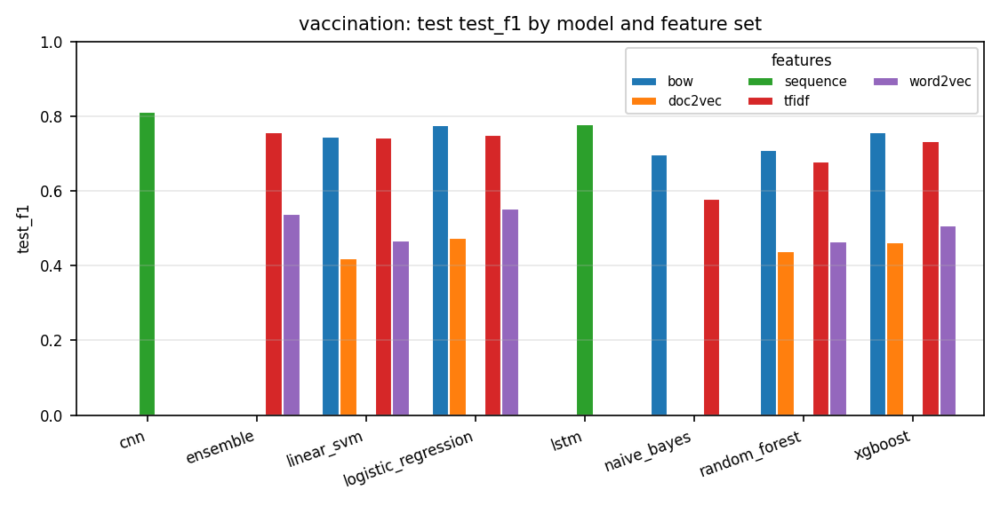
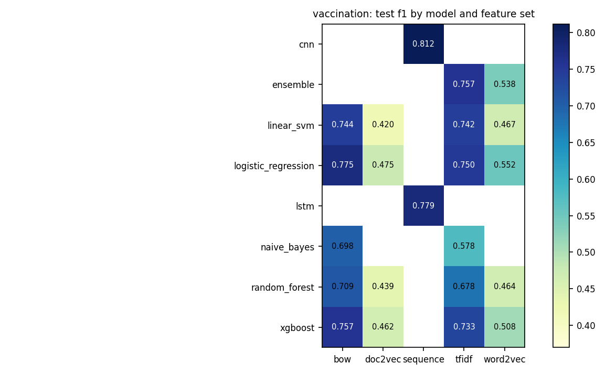
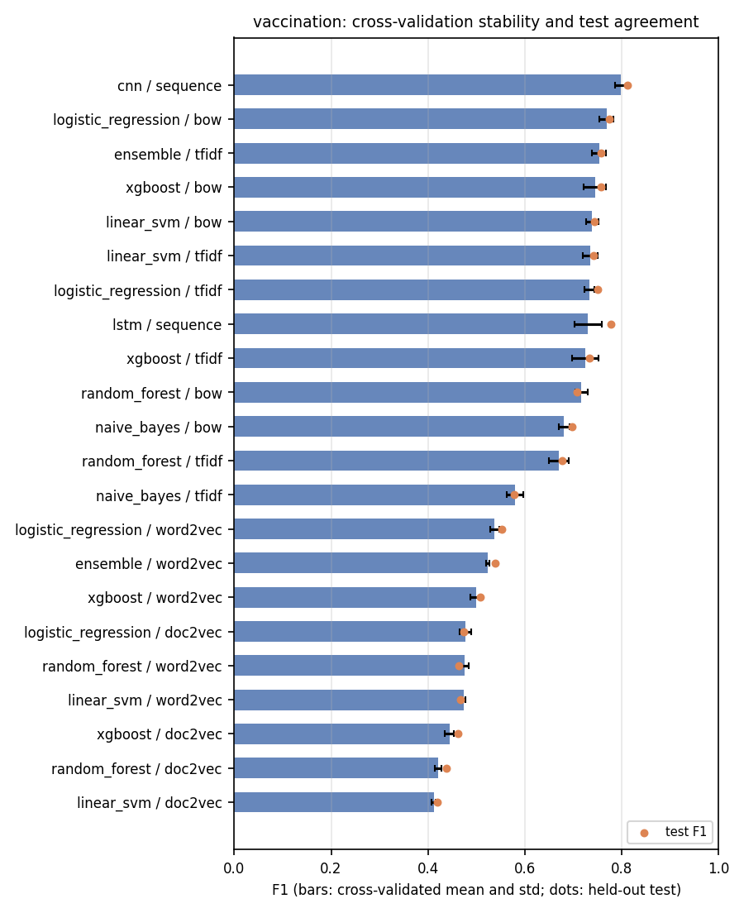
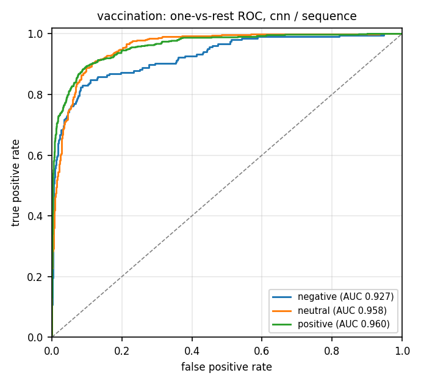
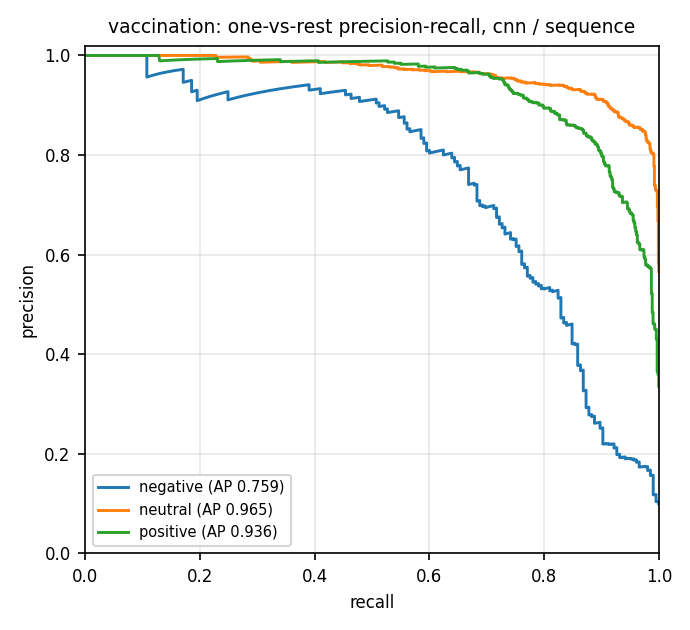
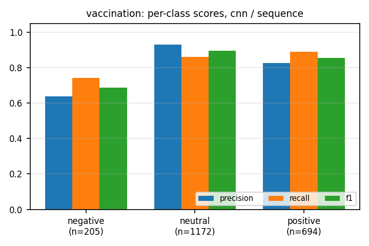
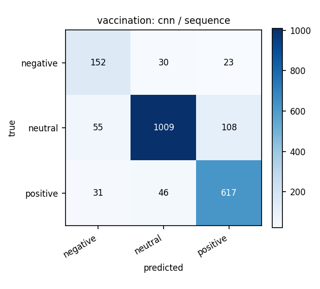
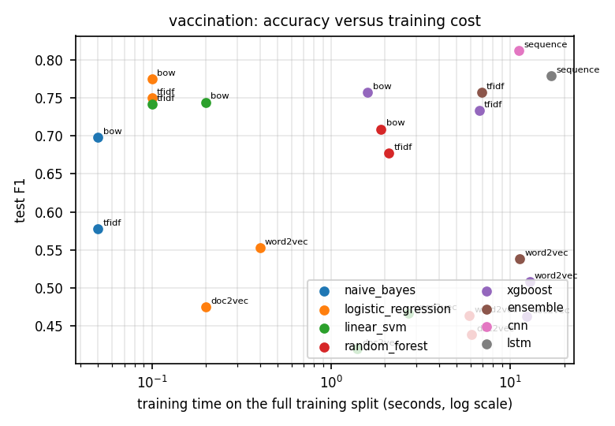

## imdb (binary, classes: negative, positive)

Best by cross-validated F1: **linear_svm + tfidf** (test F1 0.884).

| model | features | cv F1 (std) | accuracy | precision | recall | f1 | roc_auc | pr_auc | fit s |
|---|---|---|---|---|---|---|---|---|---|
| linear_svm | tfidf | 0.893 (0.002) | 0.882 | 0.870 | 0.898 | 0.884 | 0.953 | 0.952 | 0 |
| logistic_regression | tfidf | 0.892 (0.002) | 0.885 | 0.874 | 0.898 | 0.886 | 0.955 | 0.954 | 0 |
| ensemble | tfidf | 0.891 (0.002) | 0.885 | 0.869 | 0.908 | 0.888 | 0.955 | 0.954 | 45 |
| lstm | sequence | 0.879 (0.000) | 0.877 | 0.881 | 0.871 | 0.876 | 0.947 | 0.945 | 82 |
| logistic_regression | bow | 0.873 (0.003) | 0.853 | 0.836 | 0.878 | 0.856 | 0.925 | 0.921 | 1 |
| cnn | sequence | 0.872 (0.003) | 0.871 | 0.850 | 0.901 | 0.875 | 0.946 | 0.944 | 86 |
| naive_bayes | tfidf | 0.868 (0.002) | 0.850 | 0.846 | 0.855 | 0.851 | 0.925 | 0.920 | 0 |
| xgboost | tfidf | 0.862 (0.003) | 0.861 | 0.844 | 0.887 | 0.865 | 0.939 | 0.937 | 54 |
| naive_bayes | bow | 0.861 (0.003) | 0.839 | 0.825 | 0.860 | 0.842 | 0.906 | 0.890 | 0 |
| random_forest | tfidf | 0.859 (0.002) | 0.856 | 0.839 | 0.880 | 0.859 | 0.932 | 0.927 | 10 |
| xgboost | word2vec | 0.852 (0.002) | 0.840 | 0.815 | 0.879 | 0.846 | 0.922 | 0.919 | 5 |
| logistic_regression | word2vec | 0.849 (0.002) | 0.845 | 0.831 | 0.866 | 0.848 | 0.924 | 0.921 | 0 |

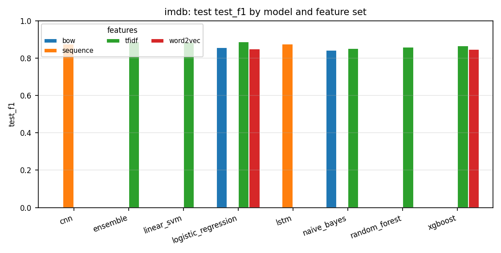
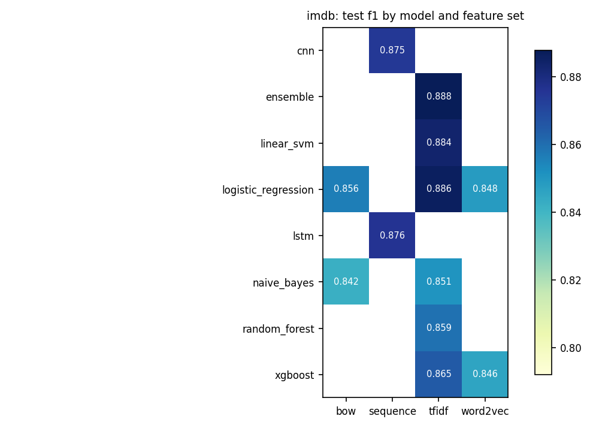
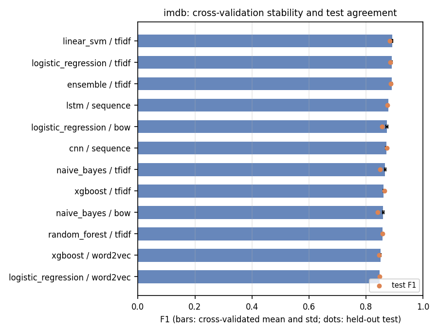
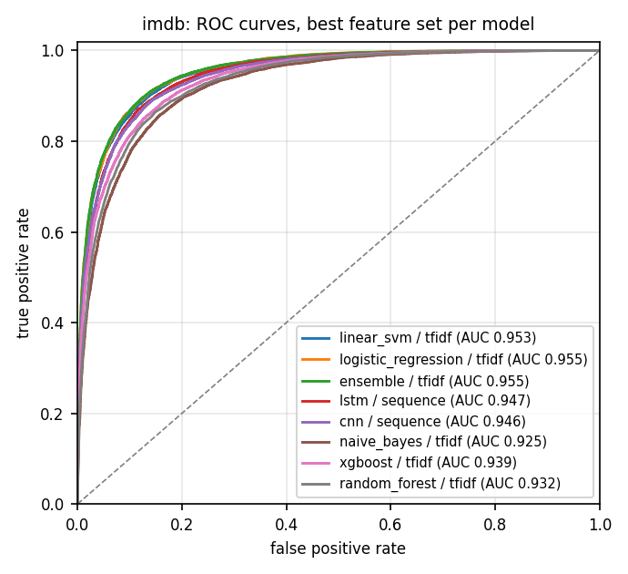
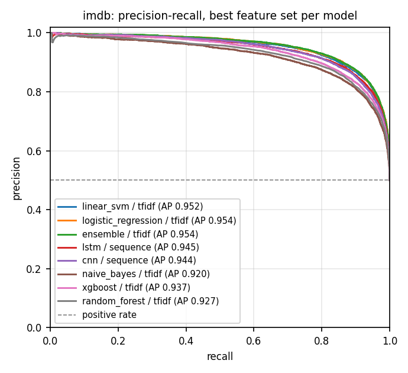
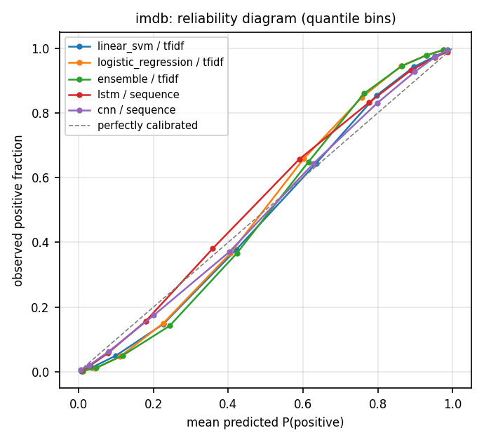
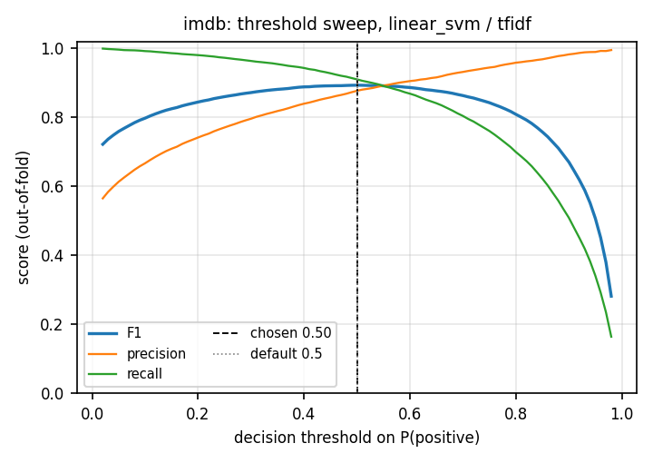
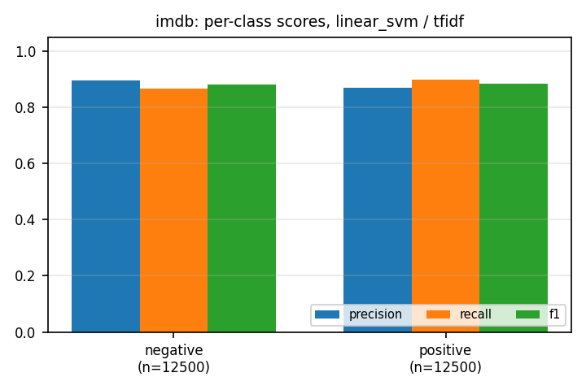
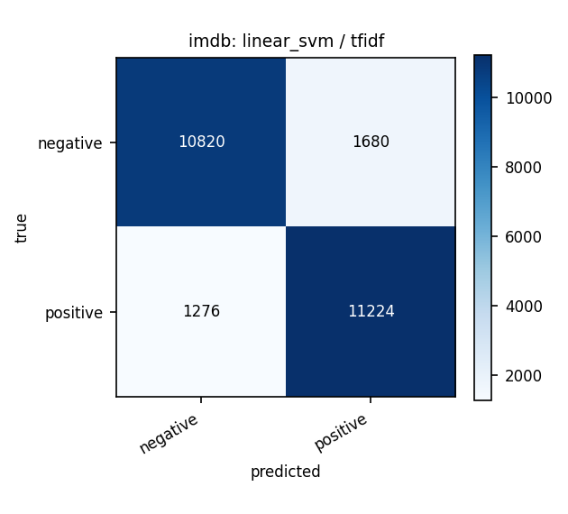
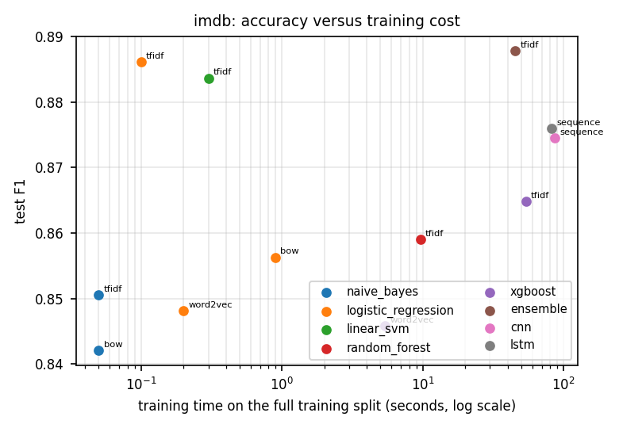
